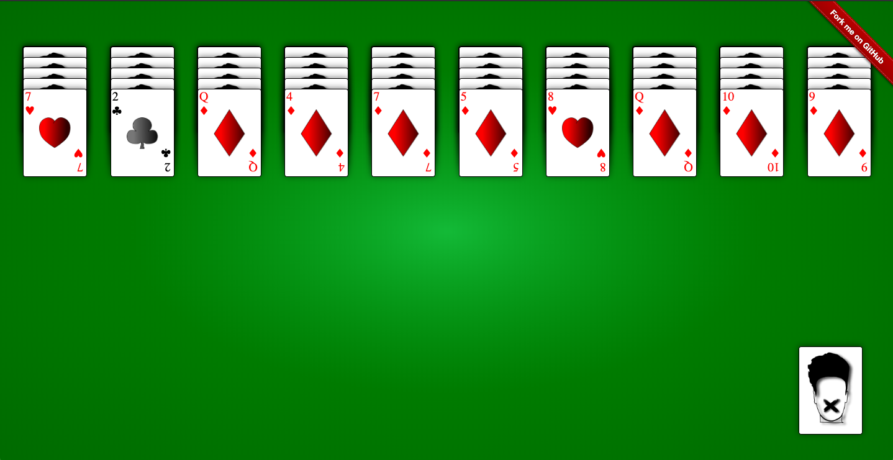
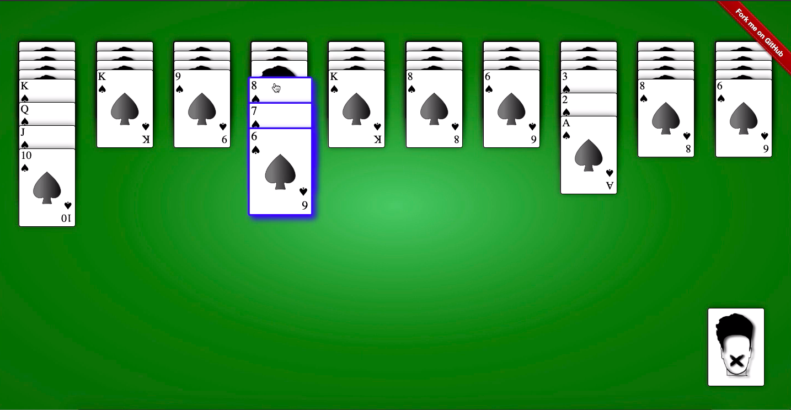

<h1 align="center">VueSolitaire</h1>
<h2 align="center">

[](https://github.com/vuejs/awesome-vue)

</h2>

<p align="center">
  


</p>


<h2 align="center"><a  href="https://solitairevue.firebaseapp.com">Live Demo</a></h2>

### [Contributions are Welcome](https://github.com/silent-lad/VueSolitaire/blob/master/CONTRIBUTING.md)

## Description

**NOW WITH DRAG AND DROP**

<p align="center">
</p>

Solitaire implemented by scratch on vue.js. It contains 3 types of solitaire namely spider(which was made famous by microsoft back when I was a kid) ,spider 4 suit and klondike. I've learned web development myself without any course or coaching so don't expect too much from the source code xD.

**This project is inspired by [AadumKhor](https://github.com/AadumKhor) Go check out his flutter implementation of the same [Here](https://github.com/AadumKhor/Solitaire_Flutter)** .

## How to play

### Drag and Drop [__Chrome,Opera__]:-

- **Drag** the card or the card pile you want to move.
- **Drop** the dragged card pile on the target and if the move is legal card will move
- Note:- Drag and Drop doesn't work for properly for **firefox** due to their lack of support to html Drag and drop API - https://bugzilla.mozilla.org/show_bug.cgi?id=505521 .

### Click edition [__Mobile,Firefox,Chrome,Safari,Opera__]-

- **Click** on the card or card pile you want to move .The pile turns to **blue**.
- **Click** on the
  destination card and if the move is legal the cards will
  stack below the target.

## About the project.

### Drag and Drop

- Drag and drop is implemented with native html5 drag and drop api with @drag, @dragend, @dragenter eventlisteners on the Card.vue component.
- Libraries like Vue.draggable were not used as i had to write most of the drag and drop logic according to the solitaire game type and I also had to **MOVE** the stack of cards.
- Ghost image in drag is removed instead the **whole stack** of card moves with cursor change.

### CSS

- Each and every card is 100% css except the SVG of the suit in the center of the card,which is made by illustrator tool.

  <p align="center"></p>

### 3 mode menu

Choose from 3 variants of solitaire form the main menu

<p align="center"></p>

# Variants

## **Klondike**

<p align="center">

</p>
<!--  -->

## **Spider 4 Suit**

<p align="center">

</p>

## **Spider 1 Suit**

<p align="center">

</p>

## Project setup

```
npm install
npm run serve
```

## Future scope

- Add winning animation.

## Support on Beerpay

Hey dude! Help me out for a couple of :beers:!

[](https://beerpay.io/silent-lad/VueSolitaire) [](https://beerpay.io/silent-lad/VueSolitaire?focus=wish)
