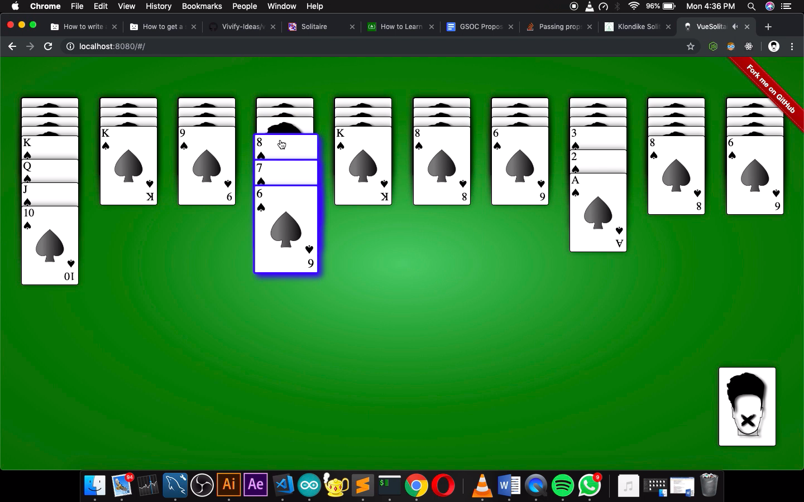
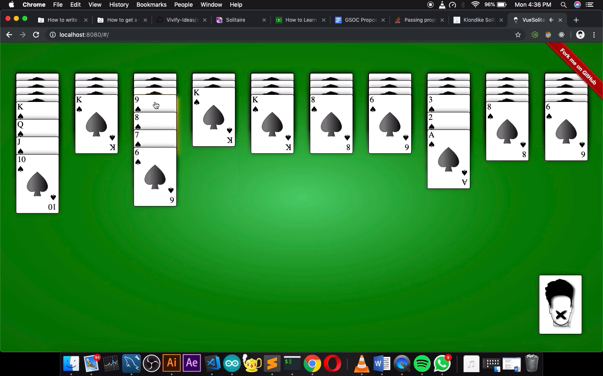
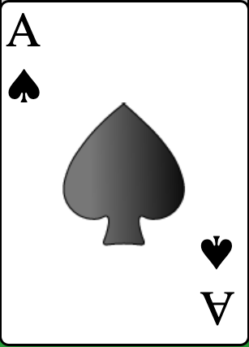
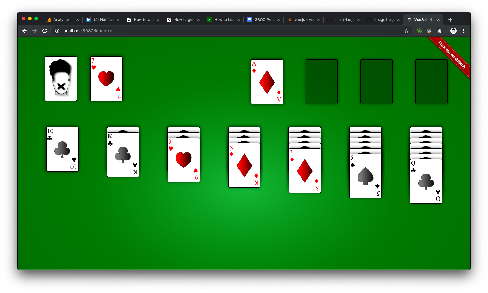
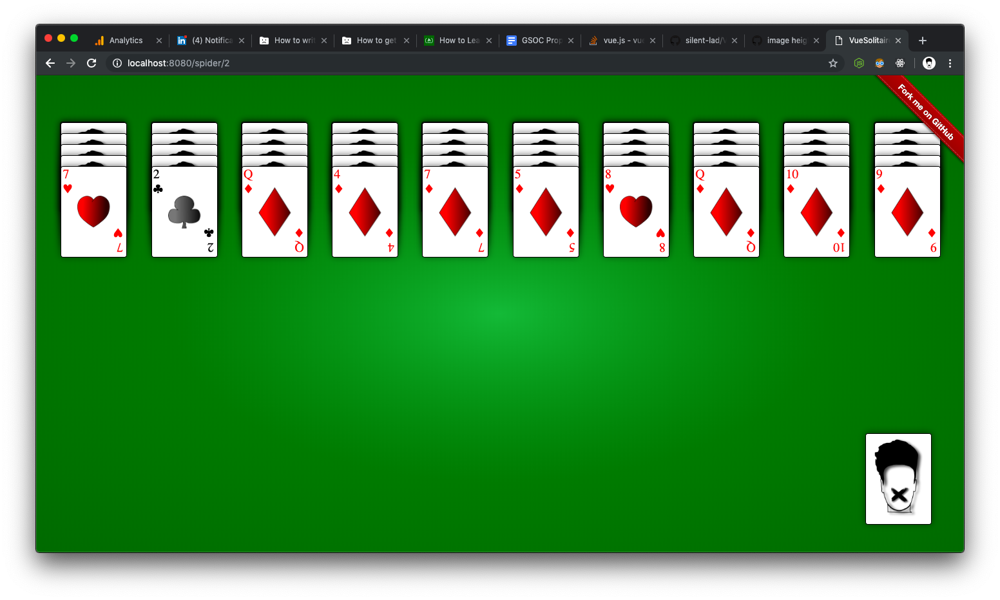

# VueSolitaire

[LIVE Demo](https://solitairevue.firebaseapp.com)

## Project setup

```
npm install
npm run serve
```

## Description

This is a simple 1 suit (spades) spider solitaire which was made famousby microsoft back when I was a kid. So i recreated it with Vue.js as a side-project inspired by [AadumKhor](https://github.com/AadumKhor) .

## How to play

- Click on the card or card pile you want to move .The pile turns to blue.



- Click on the
  destination card and if the move is legal the cards will stack below the target.



- Click the pile on the lower-right corner for extra cards.

## About the project.

### CSS

- Each and every card is 100% css except for the SVG of the suit in the center ,which is made by illustrator tool.

  

## Future scope

- Make it drag and drop compliable.
- Add winning animation.
- Make klondike one better.

# Variants

## **Klondike**



## **Spider 4 Suit**



## **Spider 1 Suit**


### Contributions are Welcome
